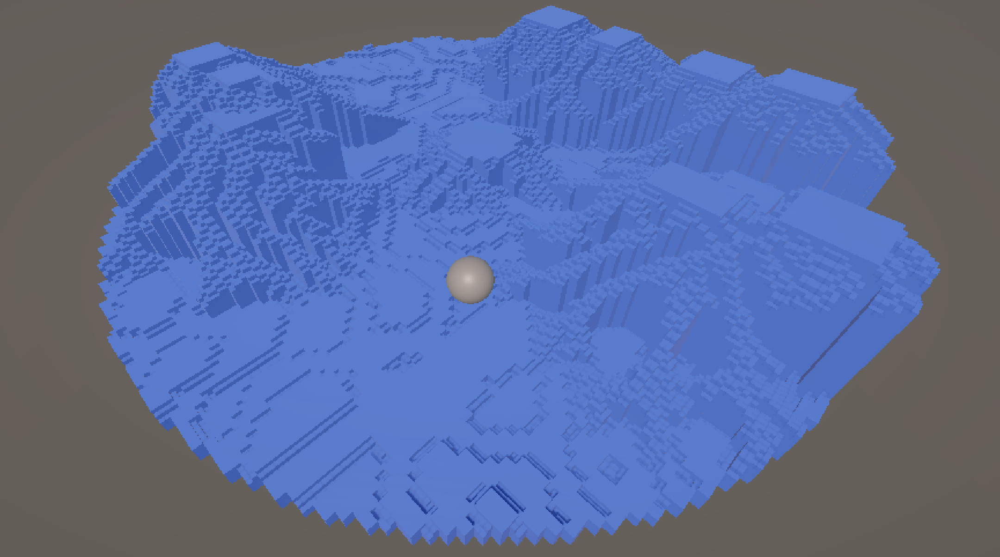
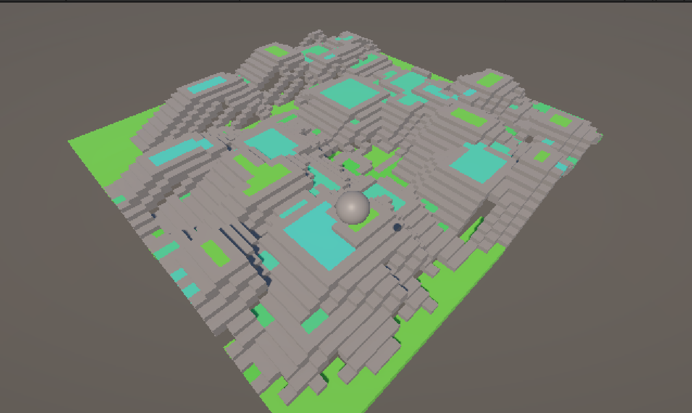
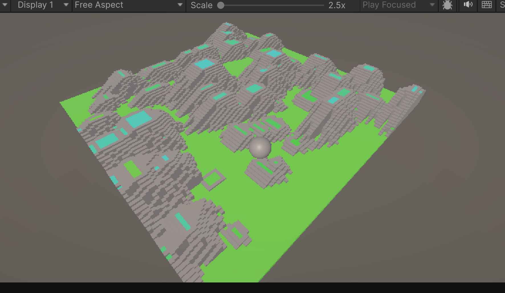
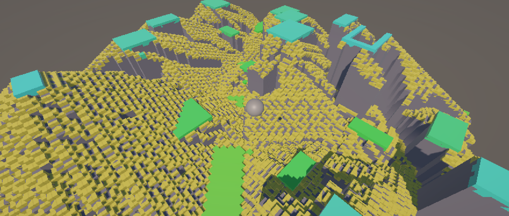
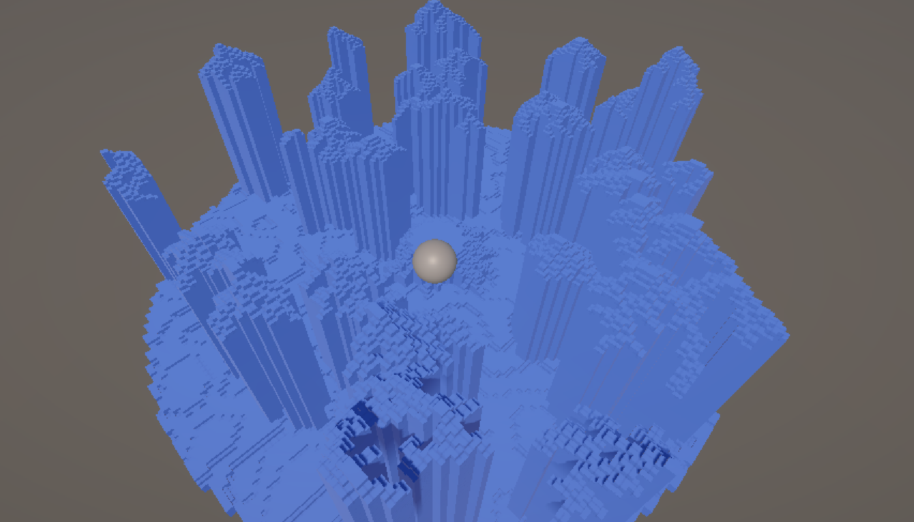
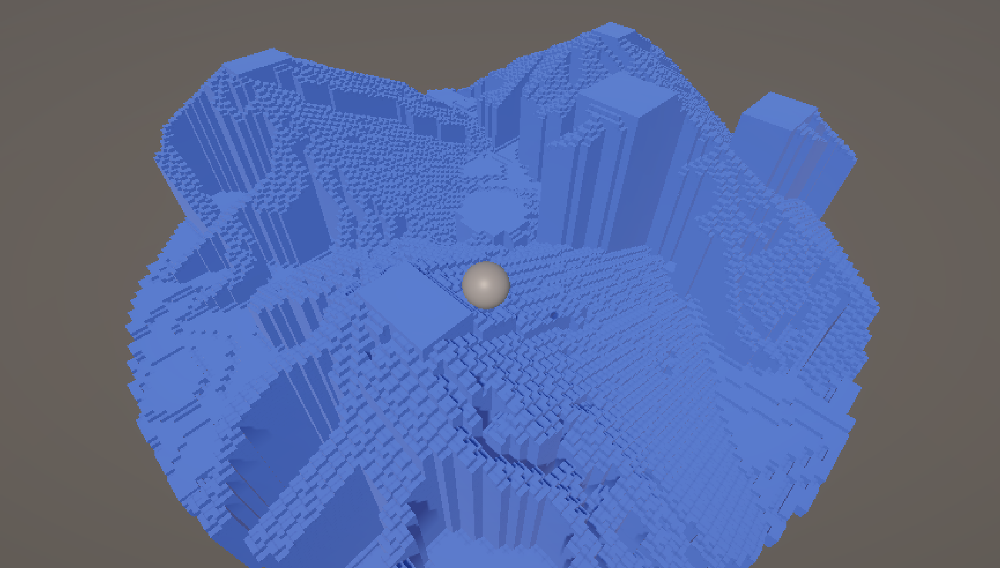

# Procedural Generation of Modular 3D Planetary Environments for _The Exiled_



Figure 1: A preview of a procedurally generated environment for the game *The Exiled*,
showcasing a circular explorable area with a central landing pad, varied platform heights, connecting stairs, and Perlin noise-enhanced terrain.

## Abstract

Procedural Content Generation (PCG) is increasingly vital for creating diverse and 
replayable experiences in modern games. This project details the design and 
implementation of a modular 3D random terrain generation system specifically tailored 
for _The Exiled_, a space adventure Roguelike game. 
The system focuses on generating varied planetary mission environments within a 
defined circular radius, featuring a safe, flat landing zone at the center. 
It employs a hybrid approach, combining parametric generation of 
explicit structures like platforms and stairs with Perlin noise for 
naturalistic terrain undulation. Key features include configurable terrain archetypes 
(e.g., rugged plateaus, pinnacle landscapes, mountainous regions) and rendering optimization 
through exposed-face culling for non-destructible voxel-based environments. 
This document outlines the iterative development process, the algorithms used for each 
generation stage, and the impact of adjustable parameters on the final output. 
Implementation details and the corresponding technical report are available.

* **Video DEMO:** [Click Here](https://drive.google.com/file/d/1n2lAmiB9Con2tiW6MxTRT6bnUPof3bpj/view?usp=sharing)
* **Full Technical Report:** [Click Here](https://drive.google.com/file/d/1kTHn6lKcN7OowqgzBWXsXzBecnABdswe/view?usp=sharing)

---

## Implementation

This study's implementation presents a hybrid procedural generation system that combines 
several techniques to create varied and navigable 3D environments for the game _The Exiled_.
The system generates a foundational terrain modified by Perlin noise, and parametrically defined platforms are placed. 
An iterative algorithm then ensures connectivity between different height levels by generating stairs. 
Special attention is given to gameplay requirements, such as a guaranteed flat landing pad at the map's center and a 
circular operational boundary for the player.

The simulation was developed using **C# in Unity 6.1**. The core generation logic is self-contained and does not rely on additional third-party packages or APIs beyond standard Unity Mathf functions (like PerlinNoise and Vector2 operations). The rendering is optimized by only instantiating GameObjects for block faces that are exposed to air, significantly reducing the object count for a static, non-destructible environment.

### Key Generation Stages & Features:

* **Circular Map with Central Landing Pad:** The generator first establishes a circular boundary for the playable area and carves out a flat, circular landing pad at a configurable height in the center. Areas outside the main radius are marked as `Empty`.
* **Perlin Noise Terrain:** For regions within the map radius but outside the central landing pad, Perlin noise is applied to a base plane (default height 0) to create natural-looking undulations. The amplitude and scale of this noise are configurable, allowing for diverse base terrain profiles, including negative (downward) extensions.
* **Parametric Platform Placement:** Platforms of varying dimensions and heights are then randomly placed onto the noise-affected terrain (or can override it). Their generation avoids the central landing pad.
* **Iterative Stair Generation:** An algorithm iteratively scans for height discrepancies between adjacent ground or platform tiles (and existing stairs) and attempts to place `Stair` type tiles to ensure navigability. This process considers a probability factor and avoids modifying the central landing pad.
* **Exposed-Face Culling for Rendering:** The visualization script (`MapVisualizer.cs`) determines the actual 3D extent of the solid terrain and iterates through each conceptual block cell. A block is only instantiated as a GameObject if at least one of its six faces is exposed to an `Empty` cell or a cell of lower height. This avoids rendering fully occluded internal blocks.

### Timeline and Visualization



Figure 2: Demo with naive stair generation. (May 7th, 2025)



Figure 3: Performance Optimization for larger scene. (May 8th, 2025)



Figure 4: Stair Prefab introduced. Refactor of `MapVisualizer()`. (May 9th, 2025)






Figure 5, 6, 7: Modulated Generation for different landscape. Occlusion culling implemented. (May 10th, 2025)

## Core Concepts in Terrain Generation

### Perlin Noise for Base Terrain
To avoid large, unnaturally flat areas when platform density is low, the system applies Perlin noise to the base ground level (outside the central landing pad).
The noise value $N(x,y)$ for a grid coordinate $(x,y)$ is calculated using `Mathf.PerlinNoise`:
$N(x,y) = \text{Perlin}((x + \text{offsetX}) \times \text{scale}, (y + \text{offsetY}) \times \text{scale})$
This value (typically in $[0,1]$) is then mapped to a signed integer height offset:
$H_{offset} = \text{round}((N(x,y) - 0.5) \times 2 \times \text{amplitude})$
This $H_{offset}$ is applied to the initial height of ground tiles, allowing for both positive and negative undulations.

```csharp
// Simplified snippet from MapGenerator.cs for noise application
float perlinValue = Mathf.PerlinNoise(
    (x + _noiseOffsetX) * _noiseScale, 
    (y + _noiseOffsetY) * _noiseScale
);
int heightOffset = Mathf.RoundToInt((perlinValue - 0.5f) * 2f * _noiseAmplitude);
Tiles[x, y].Height = heightOffset; // For non-landing pad, within-radius tiles
```

### Platform and Stair Placement

Platforms are placed at absolute heights, potentially overriding the Perlin noise layer. Their generation respects the central landing pad and circular map boundaries. Stairs are then generated iteratively:

```csharp
// Conceptual snippet from MapGenerator.CreateStairsIterative
// (Simplified - actual logic involves checking types, heights, probabilities, and center constraints)
do {
changesMadeThisPass = false;
for each tile currentTile {
for each neighborTile of currentTile {
if (currentTile can be base of stair to neighborTile) {
// Check height difference, types, central zone constraints, probability
if (height_diff == 1) {
currentTile.Type = Stair; currentTile.Direction = ...; changesMade = true;
} else if (height_diff > 1) { // Gap filling
currentTile.Height = neighborTile.Height - 1; // (or landingPadHeight - 1)
currentTile.Type = Stair; currentTile.Direction = ...; changesMade = true;
}
} else if (neighborTile can be base of stair to currentTile) {
// Similar logic, modifying neighborTile
}
if (currentTile was modified) break; // From neighbor checks
}
}
} while (changesMadeThisPass && iterations < maxIterations);
```

### Exposed-Face Culling for Visualization

To optimize rendering, only blocks with at least one face not adjoining another solid block are instantiated. This is determined by checking the six neighbors of every conceptual solid block cell within the terrain's height range.

```csharp
// Conceptual snippet from MapVisualizer.DisplayMapWithOcclusionCulling
// For each cell (gx, gy, h) from minSurfaceHeight to maxSurfaceHeight:
if (!IsCellSolid(gx, gy, h)) continue; // Skip air

isExposed = false;
for each faceDirection (6 directions) {
    (nx, ny, nh) = (gx, gy, h) + offset_for_faceDirection;
    if (!IsCellSolid(nx, ny, nh)) {
        isExposed = true;
        break;
    }
}

if (isExposed) {
    // Instantiate GameObject for block (gx, gy, h)
    // Choose prefab (ground/stair) based on Tiles[gx,gy].Type if h is surface height
}
```

## About _The Exiled_ and PCG

_The Exiled_ is a space adventure Roguelike game where players, 
as stranded explorers, undertake missions on various procedurally 
generated planetary surfaces. A key gameplay loop involves landing the 
spaceship at random locations for each new mission. 
This necessitates a robust PCG system that can create diverse, navigable, 
and functionally interesting environments within a limited radius around 
the landing site (representing the astronaut's operational range). 
The terrain generator described here aims to provide this variety, 
offering controllable elements like platforms and clear paths (stairs) 
alongside naturalistic Perlin noise details, all while ensuring a safe, 
flat area for the initial spaceship landing. 
The non-destructible nature of the terrain in "The Exiled" allows for 
rendering optimizations like exposed-face culling.


